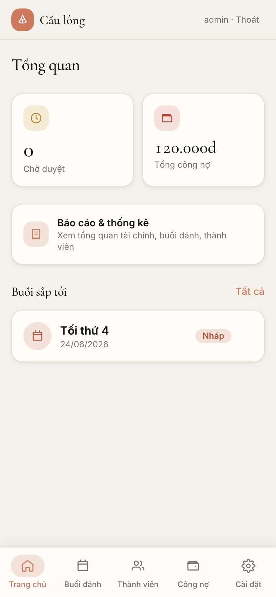
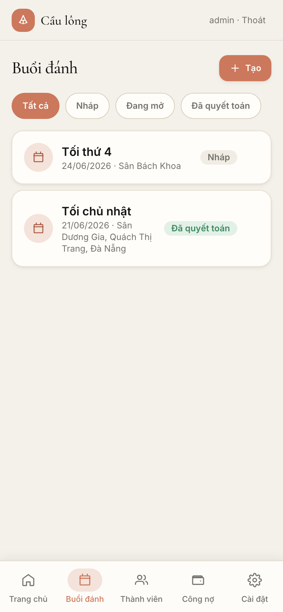
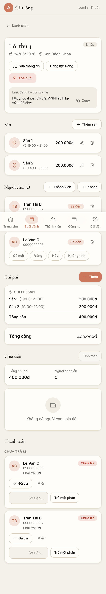
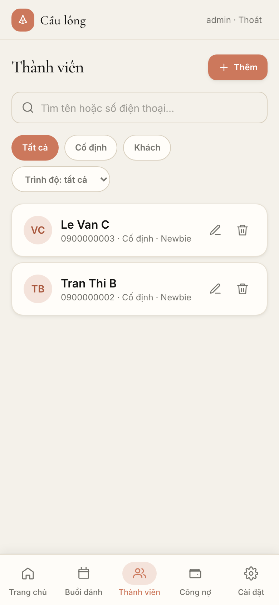
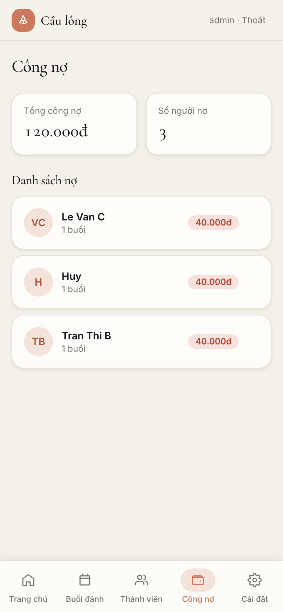
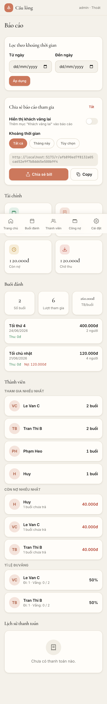
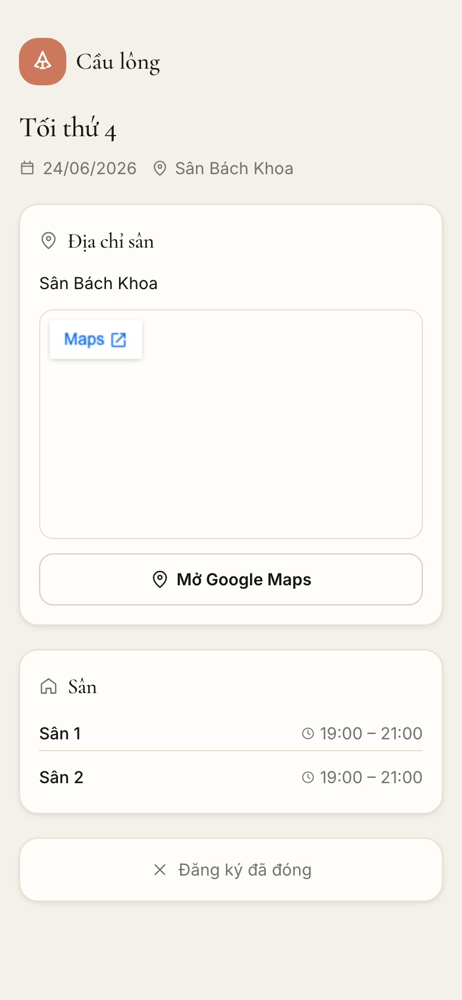

# 🏸 Badminton Host

Web app **mobile-first** giúp host/CLB cầu lông quản lý buổi đánh, điểm danh, **chia tiền tự động**, gửi **bill link riêng từng người**, theo dõi **công nợ** và **báo cáo tham gia**. Self-host bằng Docker, SQLite là source of truth — restart không mất dữ liệu.

> Một host · một CLB · không cần member đăng nhập. Admin là người dùng auth duy nhất.

---

## ✨ Tính năng

- **Thành viên** — quản lý member CLB + khách vãng lai, trình độ theo nhãn phong trào VN (Newbie → Khá+), tìm kiếm & lọc.
- **Buổi đánh & sân** — tạo buổi, thêm sân (giờ + chi phí), trạng thái nháp/mở/quyết toán.
- **Đăng ký công khai** — host share link, member tự đăng ký; **đăng ký hộ** nhiều người đi cùng (người đăng ký trả hết).
- **Điểm danh & chi phí** — duyệt đăng ký, điểm danh, chi phí sân + khoản phụ.
- **Chia tiền** — chia đều theo suất, làm tròn largest-remainder (tổng khớp tuyệt đối), tiền lưu **integer VND**.
- **Bill link riêng** — mỗi người 1 link bill (token ≥128-bit), QR ngân hàng tĩnh, share qua Web Share / Copy. Không lộ bill người khác.
- **Công nợ** — gom theo từng người, xem chi tiết từng buổi, đánh dấu đã trả / trả một phần, nhắc nợ bằng share link.
- **Báo cáo** — dashboard tài chính / buổi đánh / thành viên / thanh toán; **report public chia sẻ** số buổi tham gia (CLB vs vãng lai), tùy chỉnh khoảng thời gian + ẩn/hiện vãng lai.
- **Bản đồ sân** — trang public nhúng Google Maps theo địa chỉ buổi.
- **Backup/Restore** — export/import JSON (gồm cả QR), an toàn khi chuyển VPS.

---

## 📱 Giao diện

<table>
  <tr>
    <td align="center"><b>Trang chủ</b><br></td>
    <td align="center"><b>Buổi đánh</b><br></td>
    <td align="center"><b>Chi tiết buổi</b><br></td>
  </tr>
  <tr>
    <td align="center"><b>Thành viên</b><br></td>
    <td align="center"><b>Công nợ</b><br></td>
    <td align="center"><b>Báo cáo</b><br></td>
  </tr>
  <tr>
    <td align="center"><b>Trang public + bản đồ</b><br></td>
    <td></td>
    <td></td>
  </tr>
</table>

---

## 🛠 Công nghệ

| Layer | Stack |
|---|---|
| Frontend | React + TypeScript + Vite, React Router, Tailwind CSS |
| Backend | Node + Express + TypeScript |
| Database | SQLite (better-sqlite3, raw SQL + migration `.sql`) |
| Validation | Zod |
| Auth | Admin password + session cookie (httpOnly, argon2 hash) |
| Deploy | Docker Compose, volume `/data` |

---

## 🚀 Cài đặt & chạy

### Yêu cầu
- Node.js 20+ và npm (chạy local), hoặc Docker (deploy).

### Local development

```bash
# 1. Cài dependencies
npm install

# 2. Tạo file .env (xem .env.example)
cp .env.example .env
#   BẮT BUỘC điền: ADMIN_PASSWORD và SESSION_SECRET
#   Sinh secret: openssl rand -hex 32

# 3. Chạy (server :3000 + client :5173)
npm run dev
```

Mở **http://localhost:5173**, đăng nhập bằng `ADMIN_USERNAME` / `ADMIN_PASSWORD` trong `.env`.

### Scripts

```bash
npm run dev        # dev server + client (hot reload)
npm run build      # build client production
npm start          # chạy server production (serve API + static client)
npm test           # unit tests
npm run typecheck  # kiểm tra TypeScript
```

### Docker (self-host)

```bash
# Điền .env trước, rồi:
docker compose up -d --build
```

Dữ liệu lưu trong volume `/data` (SQLite + backups) — restart/redeploy **không mất data**.

### Biến môi trường chính

| Biến | Bắt buộc | Ghi chú |
|---|---|---|
| `ADMIN_PASSWORD` | ✅ | Mật khẩu admin (seed lúc boot nếu DB rỗng) |
| `SESSION_SECRET` | ✅ | Ký session cookie — `openssl rand -hex 32` |
| `ADMIN_USERNAME` | | Mặc định `admin` |
| `PORT` | | Mặc định `3000` |
| `APP_BASE_URL` | | URL gốc sinh bill link (vd `https://badminton.example.com`) |
| `COOKIE_SECURE` / `TRUST_PROXY` | | Bật `1` khi chạy sau reverse proxy HTTPS |

---

## 📖 Hướng dẫn sử dụng

### Host (admin)

1. **Cài đặt** → nhập tên CLB, thông tin ngân hàng + **upload QR**, mẫu nội dung CK.
2. **Thành viên** → thêm member cố định / khách, gán trình độ.
3. **Buổi đánh** → tạo buổi (ngày, địa điểm → hiện bản đồ), thêm **sân** (giờ + chi phí).
4. **Đăng ký** → bật đăng ký, copy/share link buổi cho member. Duyệt các đăng ký pending (kể cả nhóm đăng ký hộ).
5. **Điểm danh & chi phí** → tick người có mặt, thêm khoản chi phí phụ nếu có.
6. **Chia tiền** → bấm tính chia, kiểm tra số dư = 0, rồi **Quyết toán** (finalize) → sinh bill link.
7. **Thu tiền** → ở tab Thanh toán hoặc Công nợ, đánh dấu **Đã trả / Trả một phần**.
8. **Công nợ** → xem ai còn nợ bao nhiêu, share lại bill link để nhắc.
9. **Báo cáo** → xem thống kê; bật **Chia sẻ báo cáo** để gửi tình hình tham gia cho member (chọn khoảng thời gian, ẩn/hiện vãng lai).

### Member (không cần đăng nhập)

- **Đăng ký** qua link host gửi (`/s/:token` hoặc `/join/:token`) — xem địa chỉ + bản đồ sân, đăng ký cho mình và **người đi cùng**.
- **Xem bill** qua link riêng (`/b/:token`) — số tiền, QR chuyển khoản, nội dung CK; người đăng ký hộ thấy bill gộp cả nhóm.
- **Xem báo cáo tham gia** qua link public (`/r/:token`) — số buổi tham gia của các thành viên.

---

## 🔒 Nguyên tắc bảo mật & dữ liệu

- Mỗi bill link thuộc đúng 1 người, **không lộ bill người khác**; token ngẫu nhiên ≥128-bit.
- Report/bill public: header `no-store` + `no-referrer`, 404 đồng nhất cho token sai/đã tắt, **không lộ tiền/SĐT** trong report tham gia.
- Tiền lưu **integer VND** (không float); ghi nhiều bảng dùng transaction; `foreign_keys=ON` + WAL.
- Soft-delete (`deleted_at`) cho member/buổi/sân/participant/chi phí.

---

## 📂 Cấu trúc

```
src/
├── client/        # React app (pages, components, lib)
├── server/        # Express API
│   ├── routes/    # admin + public endpoints
│   ├── services/  # business logic (split, bill, debt, report…)
│   ├── schemas/   # Zod validation
│   └── db/        # connection + migrations (.sql, forward-only)
└── shared/        # types dùng chung
docs/              # tài liệu dự án + screenshots
```

Tài liệu chi tiết: [`docs/`](docs/) (codebase-summary, system-architecture, project-overview-pdr, roadmap).
